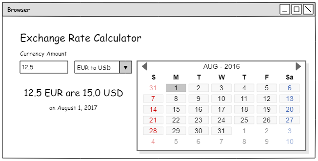
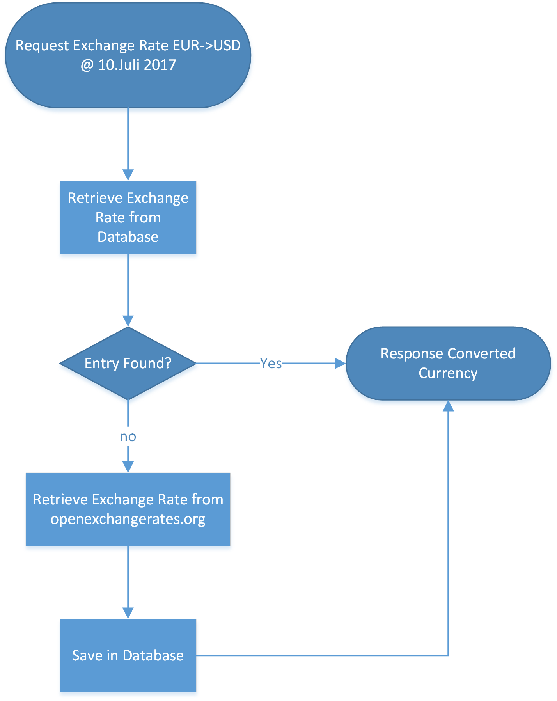

# Craft-IT Coding Challenge "Exchange Rates"

_Weekend, Oct 14 to Oct 16 2017_

__Receive €150 for a weekend of programming!__

_All_ the best selected submissions receive the money.

## Scope and Goal

The scope is to show basic understanding of API interaction with caching.

The challenge this time is to interact with a RESTful API endpoint with PHP! This time we are programming an exchange-rate retrieval.

The Goal is a frontend/backend that lets a user see the EUR/USD for a given date.

### On the Frontend-Side
There should be _one_ input for a number, then a selection if its EUR to USD or USD to EUR, and a Date-Picker. The frontend should then automatically retrieve the right value for the date and display it to the user.

It should be visually "appealing", the usage of a Frontend-CSS Framework is recommended.

### On the Backend-Side
Your Backend should be written in PHP. You can choose to make it either a RESTful service between a SPA with a frontend-framework such as Angular/Vue/React/... or you just make static pages and let a backend-framework handle the view rendering. Usage of a Framework such as Zend/Laravel/... is recommended.
Additionally it should cache exchange rates, so that it's not necessary to retrieve the same exchange rate for the same date again.

Minimum Requirement:
* Connect to the API from openexchangerates.org
* Provide a frontend where USD/EUR rates can be calculated
* Caching using any Database System you want
* Show proper handling of exceptions/sanitizing/escaping/...

Bonus:
* Usage of frontend/backend tools like bower/webpack/npm/browserify/composer/...
* Make all Currency Pairs available (by fetching them from the API)
* Make that user-based - users can login and see their exchange-query-history
* Visual Comparison between two exchange rates (two different dates)

## Rules to get the bounty
The following is a requirement:

* Publish your work somewhere on github
* Do it __on your own__ - this is not a group task
* and submit it __not later than Oct 15, 23:59:59 CEST__ **and** notify thomas@craft-it.co **and** add tomw1808 to your github/bitbucket!
* When your code is selected as one of the winners, you have to come in and prove it during a code review
* Be (at least) open to a fulltime/parttime position in our team __and take part in an interview__. You receive the bounty no matter if you are really becoming a team-member or not.
* You are not working for us and you have not participated in any of our coding challenges before
* By participating you accept that sending out invitations on submissions is at Craft-IT’s solely discretion. No submissions will be accepted later than the deadline given above!

## Rules to get an awesome Job

* Deadline: Oct 15, 23:59:59 CEST
* Same rules as above: Do it on your own, make it work, prove it in a code-review

## Where to start / What to expect?

The challenge takes a seasoned developer around 3-4 hours of work, until a meaningful result is achieved.

You can use any framework/library you feel is suitable, be it backend/frontend you want. Bonus is it runs inside the vagrant given in this directory (should make your life easier actually).

We are looking into your code the following week/weeks and get back to you as soon as possible. We are all just humans here, so please add any documentation/instruction in a way that we understand it. If it's too complicated to install: consider it a fail.

## Recommended Software

1. Install [Vagrant](https://www.vagrantup.com/)
2. Install [VirtualBox](https://www.virtualbox.org/)
3. Go to a shell/terminal/Cmd/gitbash and type `vagrant up` inside this directory.

And work with your favorite IDE inside the `./www` directory.

Point your browser to [127.0.0.1:8080](http://127.0.0.1:8080) to get the output of ./www.

type `vagrant ssh` to enter your virtual machine.

This diretory is mounted inside the virtual machine in `/vagrant`.

Make sure nothing else is running on port 8080 or edit the Vagrantfile accordingly.

## About us
[Craft IT](http://www.craft-it.co/) is a small boutique web development company located in Graz, Austria. We are passionate full-stack developers and serve international clients, with a focus on financial and analytics applications. We do work with a number of APIs from e.g. cloud accounting providers. We mostly do very custom tailored software which (more often than not) exceeds the possibilities of existing frameworks and libraries.

We are looking for new team-members who love hands-on, enjoy great teams, long term projects, a fun work-environment, tabletennis and coffee (not a must, we also have tee).

If you are looking for a job, this is the kind of work you can expect with us. If you want to join us, here's your chance (or send us your CV)!
